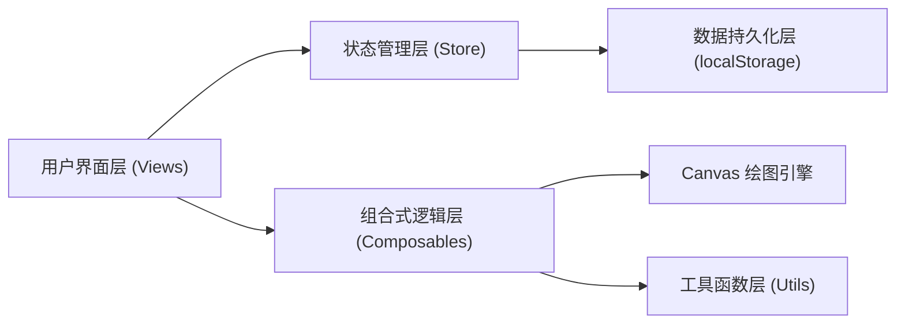
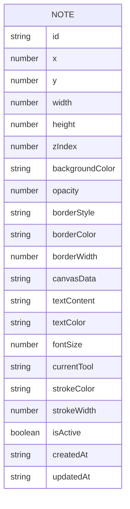

## 1. 架构设计



## 2. 技术描述

- **前端框架**：Vue 3.4 + TypeScript 5 + Vite 5
- **样式方案**：Tailwind CSS 3.4
- **初始化工具**：vite-init vue-ts 模板
- **图标库**：lucide-vue-next
- **状态管理**：Vue 3 响应式 API (reactive/ref) + Pinia 2
- **数据存储**：localStorage 本地存储
- **核心技术**：HTML5 Canvas 2D API

### 2.1 项目依赖

```json
{
  "dependencies": {
    "vue": "^3.4.0",
    "pinia": "^2.1.7",
    "lucide-vue-next": "^0.344.0"
  },
  "devDependencies": {
    "@vitejs/plugin-vue": "^5.0.0",
    "typescript": "^5.3.0",
    "vite": "^5.0.0",
    "tailwindcss": "^3.4.0",
    "postcss": "^8.4.0",
    "autoprefixer": "^10.4.0",
    "@types/node": "^20.10.0"
  }
}
```

## 3. 路由定义

| 路由 | 用途 |
|------|------|
| / | 主页面，展示桌面便签 |

## 4. 数据模型

### 4.1 数据结构定义



### 4.2 TypeScript 类型定义

```typescript
// 便签样式
interface NoteStyle {
  backgroundColor: string
  opacity: number
  borderStyle: 'solid' | 'dashed' | 'dotted' | 'none'
  borderColor: string
  borderWidth: number
}

// 绘图工具类型
type ToolType = 'pen' | 'eraser' | 'line' | 'rect' | 'circle' | 'text'

// 绘图设置
interface DrawingSettings {
  currentTool: ToolType
  strokeColor: string
  strokeWidth: number
}

// 文本设置
interface TextSettings {
  content: string
  color: string
  fontSize: number
}

// 便签数据
interface Note {
  id: string
  x: number
  y: number
  width: number
  height: number
  zIndex: number
  style: NoteStyle
  canvasData: string
  text: TextSettings
  drawing: DrawingSettings
  isActive: boolean
  createdAt: string
  updatedAt: string
}

// 应用状态
interface AppState {
  notes: Note[]
  activeNoteId: string | null
  maxZIndex: number
}
```

## 5. 组件结构

```
src/
├── components/
│   ├── AppHeader.vue          # 顶部工具栏
│   ├── StickyNote.vue         # 便签主组件
│   ├── NoteHeader.vue         # 便签标题栏（拖拽、操作按钮）
│   ├── NoteCanvas.vue         # 便签 Canvas 绘图区
│   ├── NoteToolbar.vue        # 便签绘图工具栏
│   ├── NoteTextEditor.vue     # 便签文本编辑器
│   └── NoteStylePanel.vue     # 便签样式设置面板
├── composables/
│   ├── useCanvasDrawing.ts    # Canvas 绘图逻辑
│   ├── useNoteDrag.ts         # 便签拖拽逻辑
│   └── useLocalStorage.ts     # localStorage 持久化
├── stores/
│   └── noteStore.ts           # 便签状态管理
├── types/
│   └── index.ts               # TypeScript 类型定义
├── utils/
│   ├── canvas.ts              # Canvas 工具函数
│   ├── export.ts              # 导出图片工具
│   └── id.ts                  # ID 生成工具
├── App.vue                    # 根组件
├── main.ts                    # 入口文件
└── style.css                  # 全局样式
```

## 6. 核心功能实现方案

### 6.1 Canvas 绘图实现

1. **坐标记录**：记录鼠标/触摸按下、移动、抬起事件的坐标点
2. **路径绘制**：使用 `beginPath()`、`moveTo()`、`lineTo()`、`stroke()` 绘制连续线条
3. **形状预览**：绘制矩形、圆形时，先保存画布状态，绘制预览图形，鼠标抬起后最终绘制
4. **橡皮擦**：使用 `globalCompositeOperation = 'destination-out'` 实现擦除效果
5. **数据序列化**：使用 `canvas.toDataURL()` 将画布内容序列化为 base64 字符串存储

### 6.2 便签拖拽实现

1. 监听标题栏的 `mousedown`/`touchstart` 事件
2. 记录初始鼠标位置和便签位置
3. 在 `mousemove`/`touchmove` 中计算偏移量并更新便签位置
4. 在 `mouseup`/`touchend` 中移除事件监听并保存数据

### 6.3 层级管理

1. 维护全局 `maxZIndex` 变量
2. 点击便签时将其 `zIndex` 设置为 `maxZIndex++`
3. 置顶操作：设置为当前最大 `zIndex + 1`
4. 置底操作：设置为 1，其余便签 `zIndex` 减 1

### 6.4 数据持久化

1. 使用 `watch` 监听便签数组变化
2. 防抖处理（300ms）后保存到 localStorage
3. 应用启动时从 localStorage 读取数据并恢复

### 6.5 PNG 导出

1. 创建临时 Canvas，尺寸与便签一致
2. 绘制便签背景、边框
3. 将便签的 canvas 内容绘制到临时 Canvas
4. 如果有文本，使用 `fillText()` 绘制文本
5. 使用 `toDataURL('image/png')` 生成图片 URL
6. 创建 `<a>` 标签触发下载
