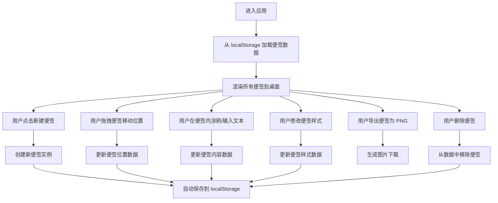

## 1. 产品概述

桌面涂鸦便签是一款基于 Canvas + Vue3 开发的轻量级网页应用，模拟系统便签的交互体验，支持多便签管理、涂鸦绘画、文本编辑等功能。通过 localStorage 实现数据持久化，刷新页面不丢失内容。

- 主要用途：快速记录灵感、绘制草图、桌面便签提醒
- 目标用户：需要快速记录和涂鸦的个人用户
- 产品价值：轻量、无需安装、即开即用、数据本地存储安全

## 2. 核心功能

### 2.1 用户角色

| 角色 | 注册方式 | 核心权限 |
|------|----------|----------|
| 普通用户 | 无需注册，直接使用 | 创建、编辑、删除便签，涂鸦绘画，导出图片 |

### 2.2 功能模块

1. **主画布区域**：便签展示桌面，支持便签拖拽、层级管理
2. **工具栏**：新建便签、工具切换、样式设置面板
3. **便签组件**：单张便签，包含画布涂鸦、文本编辑、样式设置
4. **状态管理**：便签数据的增删改查、持久化存储

### 2.3 页面详情

| 页面名称 | 模块名称 | 功能描述 |
|----------|----------|----------|
| 主页面 | 顶部工具栏 | 新建便签按钮、全局设置按钮、帮助说明 |
| 主页面 | 桌面画布区 | 便签容器，支持背景展示、便签拖拽定位 |
| 便签组件 | 标题栏 | 便签拖拽句柄、置顶/置底按钮、删除按钮、导出按钮 |
| 便签组件 | 画布涂鸦区 | Canvas 绘图区域，支持画笔、橡皮、形状绘制 |
| 便签组件 | 工具栏 | 画笔、橡皮、线条、矩形、圆形工具切换，颜色选择，粗细调节 |
| 便签组件 | 文本编辑区 | 可输入文本，支持字体大小、颜色调整 |
| 便签组件 | 样式面板 | 便签底色、透明度、边框样式设置 |

## 3. 核心流程

## 4. 用户界面设计

### 4.1 设计风格

- **设计方向**：仿 macOS 系统便签风格，轻量、简洁、小众
- **主色调**：便签使用柔和的马卡龙色系（浅黄、浅粉、浅蓝、浅绿、浅紫）
- **辅助色**：工具栏使用深灰色半透明背景，白色图标
- **按钮样式**：圆角胶囊形按钮，悬停时有轻微放大和阴影
- **字体**：使用 -apple-system, BlinkMacSystemFont, "PingFang SC", "Helvetica Neue" 等系统字体，贴近原生体验
- **便签外观**：带有轻微纸张纹理，阴影柔和，边角略微圆润
- **动画**：便签出现/消失有缩放淡入淡出效果，拖拽时有跟随阴影

### 4.2 页面设计概述

| 页面名称 | 模块名称 | UI 元素 |
|----------|----------|----------|
| 主页面 | 顶部工具栏 | 左侧：logo 和应用名；中间：新建便签按钮（黄色渐变，带加号图标）；右侧：清空按钮、帮助按钮 |
| 主页面 | 桌面背景 | 柔和的渐变色背景，可选纯色或轻微网格纹理 |
| 便签组件 | 标题栏 | 顶部细条，可拖拽，右侧有置顶、导出、删除三个图标按钮 |
| 便签组件 | 工具栏 | 位于便签底部，包含工具图标、颜色选择器、粗细滑块 |
| 便签组件 | 画布区 | 中间主要区域，可绘画，支持鼠标/触摸操作 |
| 便签组件 | 文本区 | 可折叠的文本输入区域，位于画布下方 |
| 便签组件 | 样式面板 | 点击样式按钮展开，包含底色、透明度、边框设置 |

### 4.3 响应式设计

- **桌面优先**：针对 1280px 及以上屏幕优化
- **平板适配**：768px - 1280px，调整工具栏布局，缩小便签默认尺寸
- **移动适配**：< 768px，工具栏改为底部导航，便签默认全屏或半屏
- **触摸优化**：支持触摸事件，增加按钮点击区域，优化拖拽体验
